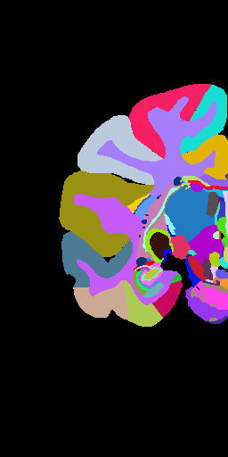
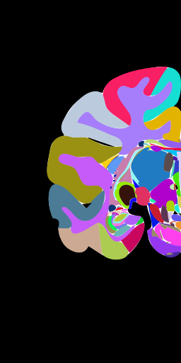
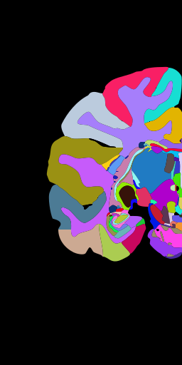

mindthegap
=============

mindthegap is an opensource tracing software developed as a part of a project in **Google Summer of Code 2014**. It vectorizes bitmaps (currenlty supports png only) without introducing gaps or overlaps between adjacent areas.

- Authors: Dhruv Kohli, Dr. Rembrandt Bakker, Dr. Piotr Majka
- Mentoring Organization: International Neuroinformatics Coordinating Facility
- [Link](https://github.com/chiggum/Vectorization-of-brain-atlases) to GSoC'14 project: Real-time Vectorization of brain atlases

Comparison
------------
A comparison between currenlty most popular open source tracing software, AutoTrace and our tracing software, mindthegap.

Usage
-------
**How to use**
- For Linux: `make -f makefile`. The binary will be generated in `bin` directory.
- For windows: Directly use exe file in `exe` directory.

Use `mindthegap -h`, for further help.

Note
-----
If the input image is such that different regions of the image can have multiple shades of same color then use the noisy switch by `-z`.